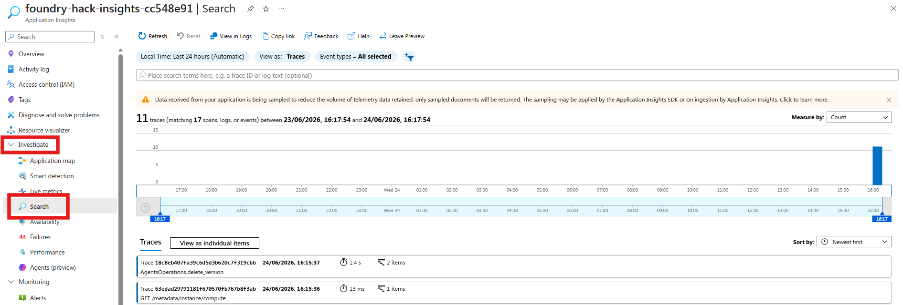

# Challenge 2: Monitor with Application Insights

Time: ~20 minutes

## Objectives

By the end of this challenge, you will have:

- ✅ GenAI tracing enabled for your Foundry agents
- ✅ Agent interactions visible as traces in Application Insights
- ✅ Understanding of how to debug agent behaviour in production


## Context

Your agents work — but how do you know they're working **well**? What if an agent misclassifies a security concern as a billing dispute? What if resolution recommendations take too long to generate during peak hours?

**Application Insights** with **GenAI tracing** gives you:

- Full trace of every agent interaction (user message → model call → tool calls → response)
- Token usage per request
- Latency breakdown (network, model inference, tool execution)
- Error tracking and alerting

## Why Monitor?

AI agents behave differently from traditional software. A conventional API either returns the right data or throws an error — you can test it deterministically. An agent's output is probabilistic: the same input can produce subtly different responses on each run, tool calls can succeed but return unexpected data, and failures can be silent (the agent responds confidently but incorrectly). Without observability, these issues are invisible until a user reports them.

Monitoring serves three critical functions for AI agents:

- **Reliability** — Detect when agents stop working (tool call failures, timeouts, empty responses) before users do
- **Performance** — Track latency and token usage over time, catch regressions when you update a system prompt, and right-size your deployments for cost efficiency
- **Debugging** — When something goes wrong, distributed traces give you a complete record of what the model reasoned, what tools were called, what they returned, and exactly where the chain broke

For production AI systems, monitoring is the foundation that makes improvement possible. You can't fix what you can't see.

For the NovaTel call center specifically: a misclassified security concern (CALL-007) routed to the billing queue means a hacked account goes unaddressed for hours. A latency spike during the morning rush means agents can't keep pace with the call queue. Without traces, you'd never know which specific tool call or model reasoning step caused the problem — or even that it happened.

## Portal or SDK?

Microsoft Foundry gives you two ways to monitor agents. The **Foundry portal** ([ai.azure.com/nextgen](https://ai.azure.com/nextgen)) has a built-in **Tracing** view where you can browse agent interactions, inspect individual spans, and see token usage and latency — no code required. **Application Insights** (via the Azure portal) gives you deeper analytics: Kusto queries, custom dashboards, and alerting rules.

In this challenge we use the **SDK** — `monitor.py` instruments your agents so every interaction is automatically captured as a distributed trace. Once the script runs, you'll explore those traces using both portal options, seeing how each one presents the same data differently.

## Prerequisites

Make sure your `.env` has:
```
AZURE_EXPERIMENTAL_ENABLE_GENAI_TRACING=true
OTEL_INSTRUMENTATION_GENAI_CAPTURE_MESSAGE_CONTENT=true
APPLICATIONINSIGHTS_CONNECTION_STRING=InstrumentationKey=xxx;...
```

## Connect Application Insights to the Portal

The deploy script automatically links Application Insights to your Foundry project. To confirm it worked, open the [Microsoft Foundry portal](https://ai.azure.com/nextgen), navigate to your project, and click **Tracing** in the left sidebar — you should see the Application Insights resource already connected.

If you see a **"Create or connect an App Insights resource to get started"** banner, the automatic connection was blocked by a tenant policy. Fix it in one click: click **Connect**, select the `foundry-hack-insights-<suffix>` resource from the dropdown, and confirm. You only need to do this once.

## Get Started

Open [monitor.py](./monitor.py) and review the tracing setup.

```bash
cd callcenter/challenge-2-monitor
python monitor.py
```

Once the script finishes, your traces are live. Explore them in the Azure Portal.

---

### Azure Portal — Application Insights

1. Go to [portal.azure.com](https://portal.azure.com) → search for **Application Insights** → open `foundry-hack-insights-<suffix>`
2. Left sidebar → **Investigate** → **Search**



3. Set the time range to **Last 30 minutes** and click **Search** — you'll see individual trace events
4. Look for traces where your agents were invoked.
   You can inspect the timestamp, operation ID, and message payload to confirm calls reached the model.
5. Click on `Resolution Advisor Agent` instance.
You will see the **end-to-end transaction trace** showing:
   - The full agent conversation (user input with call summaries → agent response with resolution recommendations)
   - Nested spans for each model call with latency breakdowns (e.g., `gpt-5.4-2026-03-05` taking 5.1 seconds)
   - The exact system prompt and generated reasoning the agent used to reach its conclusion
   - Resource details (AKS cluster, region) where the agent executed
   - Any content filtering blockers that violated default Responsible AI standards
   - This view lets you inspect exactly what the agent "saw" and "reasoned" to understand any misclassifications or performance issues
6. Open the included **App Insights Workbook** for a call-first operations view:
   1. In Application Insights, go to **Workbooks** → **+ New** → **Advanced Editor**.
   2. Open [genai-monitoring-workbook.json](genai-monitoring-workbook.json) and copy its JSON.
   3. Paste into the Advanced Editor, then click **Apply** and **Done Editing**.
   4. Save it as **Call Center GenAI Tracing Workbook**.
   5. Use this workbook to track:
      - Agent-level KPIs (invocations, latency, token usage, error count)
      - Traces per call (`CALL-001` through `CALL-007`) and customer IDs
      - Intent and priority distribution over recent traces
      - Business context (`NovaTel Communications`, `Customer Support`)
      - Tool call health for `lookup_customer`

   If the workbook says **"The query returned no results"**, run `python monitor.py` again and refresh the workbook after 1-2 minutes. The workbook queries depend on recent traces that include call IDs (`CALL-001`, `CALL-007`) and customer IDs.

---

## Success Criteria

- [ ] You can see at least one agent trace in Application Insights
- [ ] The trace shows the full conversation flow (user → agent → tool → response)
- [ ] You understand where to look when an agent misbehaves
