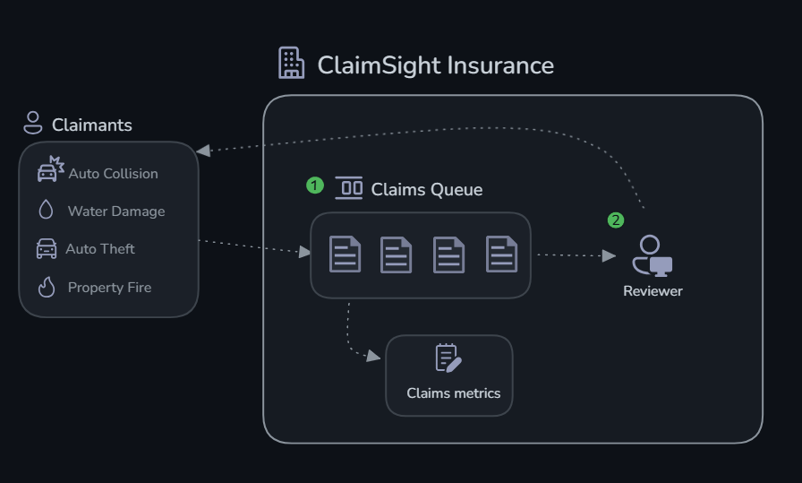
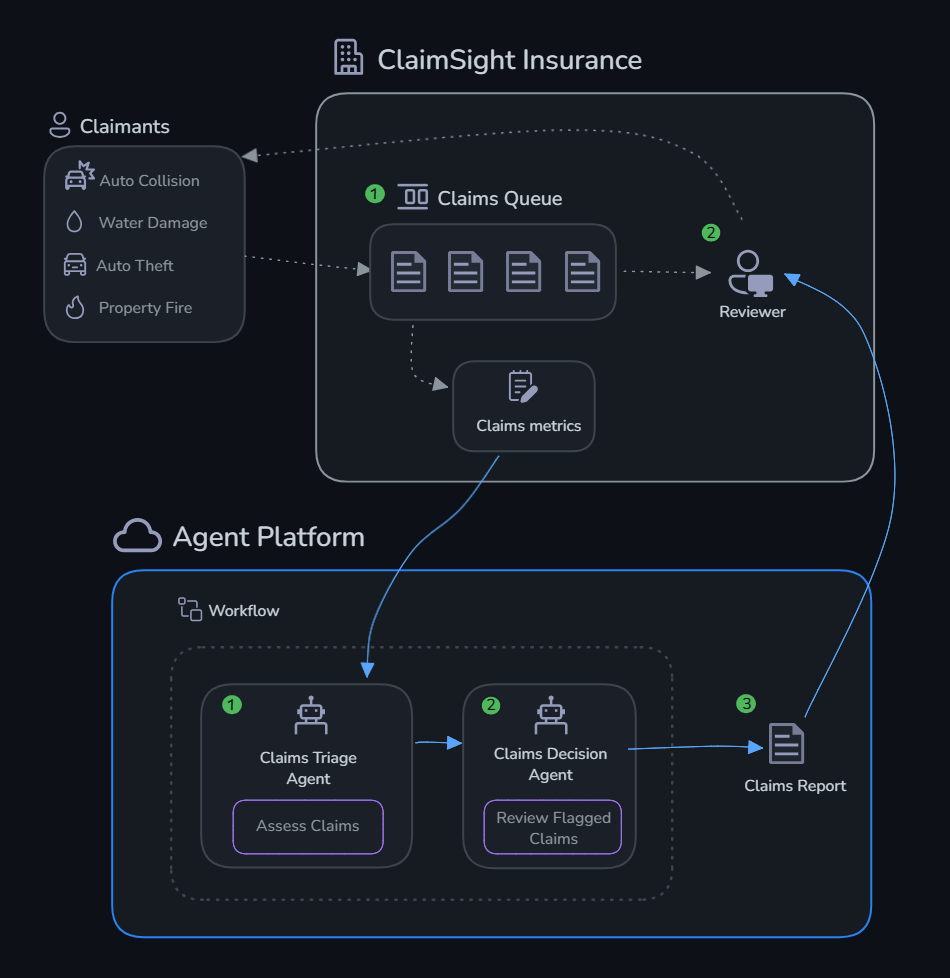
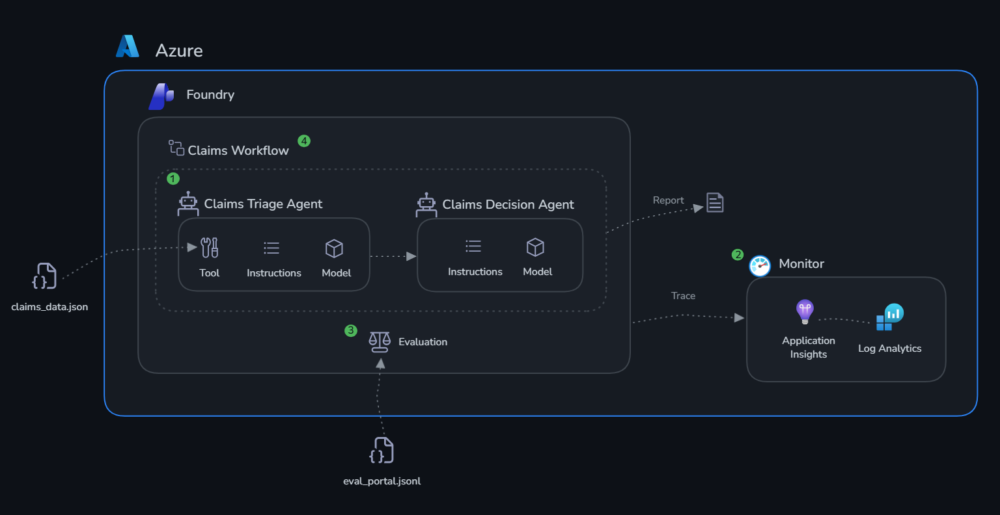

# 📋 Scenario: AI Agents for Insurance Claims Processing

## Scenario

You work at **ClaimSight Insurance**, a property and auto insurance company that processes hundreds of claims daily. Each claim has associated metrics: document completeness, damage-vs-estimate consistency, fraud risk scoring, and policy coverage matching. Lately, fraudulent claims and processing delays have been costing the company millions.

Your mission: **Build AI agents using Microsoft Foundry** that can triage incoming claims and make intelligent processing decisions — flagging suspicious claims for investigation while fast-tracking legitimate ones.

You'll build two agents:

1. **Claims Triage Agent** — Assesses claim metrics against acceptable thresholds and flags anomalies
2. **Claims Decision Agent** — Takes flagged claims and recommends actions (approve, investigate, request documents, deny)

## The Claims

| Claim | Type | Claimant | Status |
|-------|------|----------|--------|
| CLM-001 | Auto Collision | Maria Torres | 🔴 Critical |
| CLM-002 | Property Water Damage | James Chen | ✅ Normal |
| CLM-003 | Auto Theft | Robert Kim | ⚠️ Warning |
| CLM-004 | Property Fire | Sarah Williams | ✅ Normal |
| CLM-005 | Auto Collision | David Okafor | ⚠️ Warning |

## Prerequisites

- **Azure subscription** with Contributor access
- **Python 3.10+** installed locally
- **Azure CLI** (`az`) installed and logged in (`az login`)
- A terminal (bash, PowerShell, or WSL)
- ~20 minutes for infrastructure provisioning (run `challenge-0-setup/deploy.sh` from the repo root first!)

## Structure

All challenges are Python SDK-based. Challenge 4 also walks you through the Foundry portal to build and test the multi-agent workflow visually.

## Challenges

| # | Challenge | Duration | What You'll Do |
|---|-----------|----------|----------------|
| 0 | [Setup](./challenge-0-setup/README.md) | 20 min | Provision resources, verify auth |
| 1 | [Build Agents](./challenge-1-build/README.md) | 30 min | Create claims triage & decision agents |
| 2 | [Monitor](./challenge-2-monitor/README.md) | 20 min | Enable tracing, explore App Insights |
| 3 | [Evaluate](./challenge-3-evaluate/README.md) | 30 min | Run evaluations, interpret quality metrics |
| 4 | [Workflow](./challenge-4-deploy/README.md) | 20 min | Build a multi-agent workflow: triage → decision → claims report |

## Why the Challenges Are in This Order

**Build first.** Without precise instructions and real claim data, the agents can't make useful decisions. The Claims Triage Agent without `assess_claim` is pattern-matching on claim descriptions — it has no way to check actual fraud scores, document completeness ratios, or damage-estimate variance. Ambiguous system prompts mean inconsistent decisions: the same risk profile might get approved one day and flagged the next.

**Then monitor.** Every decision the Claims Decision Agent makes needs to be traceable. For insurance claims, that's not optional — it's a business and regulatory requirement. Application Insights traces give you a complete record: what data the agent received, which tools it called, and exactly what it recommended. When an auditor asks why CLM-003 was sent for investigation, that trace is your answer.

**Then evaluate.** Two claims with the same fraud score and document completeness should get the same recommendation. Evaluation gives you a repeatable way to check that they do — and catches it when a prompt update breaks that consistency before it affects real claims.

**Then deploy.** The portal workflow connects triage to decision, processes a full claims batch, and produces a report that compliance teams can sign off on. That's the difference between a demo and something you'd put in front of an actual adjuster.

## Architecture

## Next Steps

Completing these challenges gives you a working multi-agent system with observability and evaluation in place. Here are the directions you can take it further:

**Deploy as a hosted agent endpoint**
Microsoft Foundry can host your agents as persistent, scalable API endpoints — no infrastructure to manage. Once hosted, your claims intake system can submit new claims directly to the Triage Agent and receive a structured decision (approve / investigate / request documents / deny) without any manual triage step.

**Add more tools to your agents**
The `assess_claim` function in this lab uses local mock data. In production you'd replace it with tools that call real systems:
- A `fetch_policy` tool querying your policy management system for the exact coverage terms, exclusions, and limits applicable to a specific claim
- A `check_fraud_database` tool querying a fraud intelligence service for known patterns matching the claimant's history
- A `request_documents` tool that automatically triggers a document request workflow in your DMS when the agent recommends it

**Build a knowledge base**
Upload ClaimSight's insurance policy documents, regulatory compliance guidelines, and fraud pattern library to a Microsoft Foundry knowledge base. Attach it to the Claims Decision Agent as a File Search tool so its recommendations cite actual policy language — producing decisions that are auditable and defensible to regulators.

**Integrate evaluations into CI/CD**
Run your evaluation dataset automatically on every pull request or deployment. If the coherence or relevance score drops below a threshold (e.g. 3.5 out of 5), block the release. In a regulated industry, this isn't just good practice — it's the kind of quality gate that compliance and audit teams expect to see documented.

**Explore advanced agent patterns**
- **Parallelise** triage across all incoming claims simultaneously instead of sequentially
- **Add confidence thresholds** — if the Triage Agent's fraud risk assessment falls in an ambiguous range, route to a senior adjuster rather than passing to the Decision Agent automatically
- **Human-in-the-loop** — for high-value claims (above a configurable threshold), always require human adjuster sign-off before the Decision Agent's recommendation is acted on

**Fine-tune for your domain**
Use your evaluation results to identify systematic errors — claim types the agent consistently misjudges or fraud indicators it underweights. Use those cases to refine system prompts, add targeted few-shot examples, or fine-tune the underlying model on ClaimSight's historical claim decisions.
