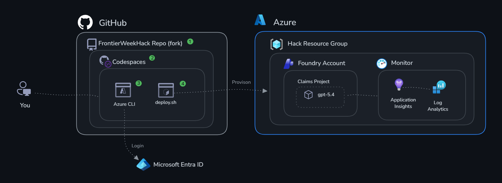

# Challenge 0: Setup & Authentication

Time: ~20 minutes

## Objectives

By the end of this challenge, you will have:

- ✅ A fully provisioned Microsoft Foundry project with a deployed model
- ✅ Application Insights provisioned and connection string available
- ✅ Verified authentication from your local machine to Foundry
- ✅ Confirmed your agent endpoint is working



## Get Started

There are two ways to get started — pick one:

> **First step for both options:** [Fork this repository](https://github.com/microsoft/FrontierWeekHack/fork) to your own GitHub account.

### Option A: GitHub Codespaces (recommended)

No local installs needed. Everything runs in a cloud dev environment.

[](https://codespaces.new/microsoft/FrontierWeekHack)

1. Click the badge above (select your fork if applicable)
2. Wait for the Codespace to build (~2 min)
3. In the terminal, login to Azure and deploy your scenario:

```bash
az login
```

4. Continue to **Deploy Infrastructure** below.

---

### Option B: Local environment

Run everything on your own machine. Requires Python 3.10+ and Azure CLI.

```bash
# 1. Clone this repo
git clone https://github.com/microsoft/FrontierWeekHack.git
cd FrontierWeekHack

# 2. Create and activate a virtual environment
python3 -m venv .venv
source .venv/bin/activate  # On Windows: .venv\Scripts\activate

# 3. Install Python dependencies
pip install -r requirements.txt

# 4. Login to Azure
az login
```

4. Continue to **Deploy Infrastructure** below.

## Deploy Infrastructure

From the **claims** folder, run the deploy script:

```bash
bash challenge-0-setup/deploy.sh
```

This will provision all resources **and** automatically write your `.env` file to the repository root as `.env`.

## Success Criteria

- [ ] You can see your AI Foundry project in the Azure Portal
- [ ] A model deployment for gpt-5.4 shows "Succeeded" status
- [ ] You can send a test message in the Foundry Playground (Portal)
