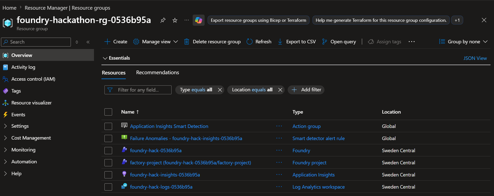
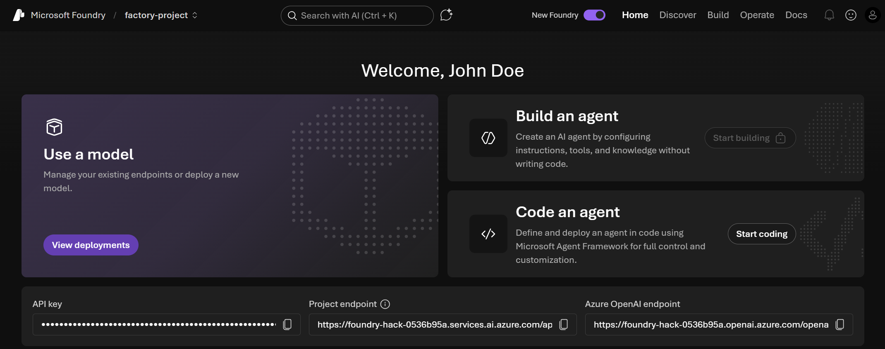

# Challenge 0: Setup & Authentication

Time: ~20 minutes

## Objectives

By the end of this challenge, you will have:

- ✅ A fully provisioned Microsoft Foundry project with a deployed model
- ✅ Application Insights provisioned and connection string available
- ✅ Verified authentication from your local machine to Foundry
- ✅ Confirmed your agent endpoint is working


## Get Started

> [!NOTE]
> Before you begin, make sure you have:
> - An **Azure subscription** where you hold both the **Contributor** role (to deploy the infrastructure) and the **Foundry User** role on the Foundry account (to build, evaluate, and run agents in Challenges 1–4).
> - A **GitHub handle** (account) to fork this repository and run it in GitHub Codespaces.
>
> Subscription **Owner** (or Contributor) rights alone are **not** sufficient. Those grant control-plane access to create and manage resources, but building and running agents are data-plane operations that require the separate **Foundry User** role assigned on the Foundry account. An Owner can self-assign it; a Contributor must ask an admin to assign it after deployment.

There are two ways to get started — pick one:

> **First step for both options:** [Fork this repository](https://github.com/microsoft/FrontierWeekHack/fork) to your own GitHub account.

### Option A: GitHub Codespaces (recommended)

No local installs needed. Everything runs in a cloud dev environment.

[](https://codespaces.new/microsoft/FrontierWeekHack)

1. Click the badge above (select your fork if applicable)
2. Wait for the Codespace to build (~2 min)
3. In the terminal, log in to Azure:

```bash
az login
```

4. Continue to **Deploy Infrastructure** below.

---

### Option B: Local environment

Run everything on your own machine. Requires Python 3.10+ and Azure CLI.

```bash
# 1. Clone this repo
git clone https://github.com/microsoft/FrontierWeekHack.git
cd FrontierWeekHack

# 2. Create and activate a virtual environment
python3 -m venv .venv
source .venv/bin/activate  # On Windows: .venv\Scripts\activate

# 3. Install Python dependencies
pip install -r requirements.txt

# 4. Log in to Azure
az login
```

4. Continue to **Deploy Infrastructure** below.

## Deploy Infrastructure

From the **claims** folder, run the deploy script:

```bash
bash challenge-0-setup/deploy.sh
```

This will provision all resources **and** automatically write your `.env` file to the repository root as `.env`.

## Verify the creation of your resources

Go to the [Azure Portal](https://portal.azure.com/) and find your resource group, which should now contain resources like this (exact names will differ depending on scenario):



Go to the [Microsoft Foundry Portal](https://ai.azure.com) and verify that you can access the Foundry project.



Select **Build** in the top navigation, then **Models**, and verify that the **gpt-5.4** model is deployed.


Select **gpt-5.4**, enter a test message in the model playground, and verify that you get a response.


## Success Criteria

- [ ] You can see your Microsoft Foundry project in the Azure Portal
- [ ] A model deployment for gpt-5.4 shows "Succeeded" status
- [ ] You can send a test message in the Foundry Model Playground
