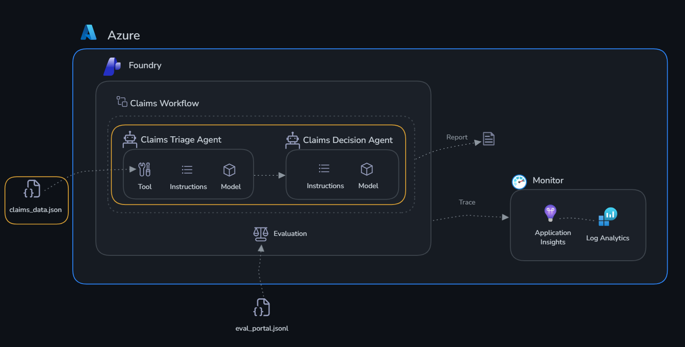

# Challenge 1: Build Agents

Time: ~30 minutes

## Objectives

By the end of this challenge, you will have:

- ✅ A **Claims Triage Agent** that assesses incoming claims and flags risks
- ✅ A **Claims Decision Agent** that analyzes flagged claims and recommends actions
- ✅ Both agents tested against real claims data



## Context

ClaimSight Insurance processes hundreds of claims daily. Each claim has associated metrics: document completeness, damage-vs-estimate consistency, fraud risk score, and policy coverage match. Your agents need to:

1. **Claims Triage**: Compare claim metrics against acceptable thresholds and flag claims that need attention
2. **Claims Decision**: Given a flagged claim, determine the recommended action (approve, investigate, request documents, or deny)

Check out [claims_data.json](./claims_data.json) to see the current batch of claims.

## Portal or SDK?

Microsoft Foundry gives you two ways to build agents. The **Foundry portal** ([ai.azure.com/nextgen](https://ai.azure.com/nextgen)) provides a visual, no-code interface where you can create agents, attach tools, and test them interactively in a playground — great for exploration and rapid prototyping. The **Azure AI Agents SDK** gives you full programmatic control: you define agent behavior, tools, and orchestration logic in Python, which makes it easy to version, test, and integrate into automated pipelines.

In this challenge we use the **SDK**. The code in [agents.py](./agents.py) creates both agents, registers their tools, and runs them against every claim in `claims_data.json` — all from the terminal. After the script runs, both agents will also be visible in the portal under **Agents**, so you can inspect them, tweak their instructions, and test them interactively without touching any code.

## Agents and Tools

### What is an agent?

An agent in Microsoft Foundry is a persistent, stateful AI assistant backed by a large language model. Unlike a plain API call — where you send a prompt and get a single response — an agent maintains a **conversation thread**, can **invoke tools autonomously**, and **retains context** across multiple turns. You configure it with:

- A **name** and **model** (e.g. `gpt-5.4`)
- A **system prompt** — instructions that define its role, personality, and constraints
- One or more **tools** it can call when it needs information or actions beyond its training data

Agents are managed resources in your Foundry project. They persist between runs, appear in the portal under **Agents**, and can be versioned, shared, and reused.

### What are tools?

Tools extend an agent's capabilities beyond pure language generation. When the model decides it needs information it doesn't have in its context window, it emits a **tool call** — a structured JSON request specifying the tool name and arguments. The SDK intercepts this, runs the corresponding Python function, and feeds the result back to the model. This reasoning loop continues until the agent produces a final response.

From the model's perspective, tools are described by a **JSON schema** (name, description, parameters). The model reads these descriptions and decides autonomously when and how to call them — you never hard-code the decision logic.

### What tools can you add?

| Tool type | What it does | Best for |
|-----------|-------------|----------|
| **Function** | Calls a local Python function you define | Any custom logic: database lookups, APIs, calculations |
| **Code Interpreter** | Lets the agent write and execute Python in a sandbox | Data analysis, chart generation, file processing |
| **File Search** | Semantic search over a Microsoft Foundry knowledge base | Policy docs, manuals, historical records |
| **Bing Search** | Live web search | Real-time information, news |
| **Azure AI Search** | Queries an Azure Search index | Grounded retrieval over your own data at scale |

#### Vector databases and Microsoft Foundry knowledge bases

When your agent needs to answer questions grounded in a large body of documents — policy manuals, product specs, historical records — you need a **vector database**. Unlike keyword search, a vector database converts text into numerical embeddings and finds semantically similar passages at query time. This lets the agent ask a natural-language question and retrieve the right content even when the exact words don’t appear in the query.

**Microsoft Foundry** includes a built-in knowledge base backed by a vector store. You upload documents (PDFs, Word files, plain text) and the service automatically chunks, embeds, and indexes them. When you attach this knowledge base to an agent as a **File Search** tool, the agent queries it at inference time — pulling relevant passages into its context before generating a response, so its answers are grounded in your actual documents rather than model training data alone.

For ClaimSight Insurance, useful knowledge bases would include:

- **Insurance policy documents** — coverage terms, exclusion clauses, and payout limits by policy type (auto, property, liability)
- **Regulatory compliance guidelines** — state-specific claim handling rules, mandatory timelines, and disclosure requirements
- **Fraud pattern library** — documented fraud schemes, red-flag indicator combinations, and historical case summaries

With this in place, the **Claims Decision Agent** could query “what is the coverage limit for water damage on a standard home policy in California?” and retrieve the exact policy terms — grounding its approve/deny recommendation in the actual policy language rather than a general understanding of insurance.

In this challenge the agents use **function tools**. The **Claims Triage Agent** uses `assess_claim` to retrieve full claim metrics — document completeness, fraud risk score, damage estimates — before scoring risk. Without this tool, the agent would have to guess from context alone — with it, every triage decision is grounded in the claim's actual data.

## Get Started

Open [agents.py](./agents.py) and review the implementation of both agents.

```bash
cd claims/challenge-1-build
python agents.py
```

As the script runs, watch the terminal closely — you'll see each agent being created, then each claim from `claims_data.json` being sent through the **Claims Triage Agent** first, and its output handed off to the **Claims Decision Agent**. You'll see the raw agent responses printed for every claim, giving you a live view of how the two agents collaborate. Once it completes, head to the [Microsoft Foundry portal](https://ai.azure.com/nextgen), open your project, and navigate to **Agents** in the left sidebar — hit **Refresh** if the agents don't appear immediately, as it can take a few seconds for newly created agents to show up in the portal.

## Success Criteria

- [ ] Claims Triage Agent correctly identifies the 2 warning + 1 critical claim
- [ ] Claims Decision Agent provides reasonable action recommendations
- [ ] Both agents respond coherently when given a claim's metrics
