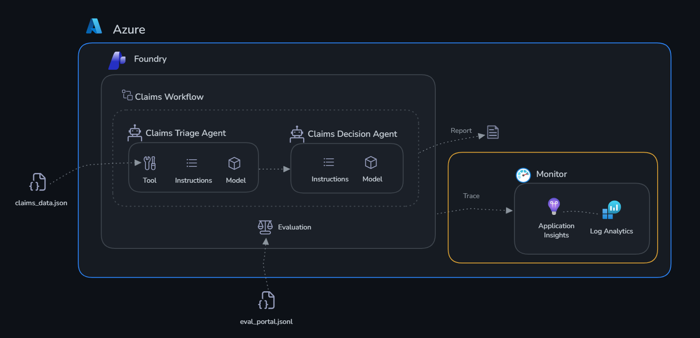

# Challenge 2: Monitor with Application Insights

Time: ~20 minutes

## Objectives

By the end of this challenge, you will have:

- ✅ GenAI tracing enabled for your Foundry agents
- ✅ Agent interactions visible as traces in Application Insights
- ✅ Understanding of how to debug agent behaviour in production



## Context

Your agents work — but how do you know they're working **well**? What if an agent misclassifies a legitimate claim as fraud? What if latency spikes during peak filing hours? What if a tool call fails silently?

**Application Insights** with **GenAI tracing** gives you:

- Full trace of every agent interaction (user message → model call → tool calls → response)
- Token usage per request
- Latency breakdown (network, model inference, tool execution)
- Error tracking and alerting

## Why Monitor?

AI agents behave differently from traditional software. A conventional API either returns the right data or throws an error — you can test it deterministically. An agent's output is probabilistic: the same input can produce subtly different responses on each run, tool calls can succeed but return unexpected data, and failures can be silent (the agent responds confidently but incorrectly). Without observability, these issues are invisible until a user reports them.

Monitoring serves three critical functions for AI agents:

- **Reliability** — Detect when agents stop working (tool call failures, timeouts, empty responses) before users do
- **Performance** — Track latency and token usage over time, catch regressions when you update a system prompt, and right-size your deployments for cost efficiency
- **Debugging** — When something goes wrong, distributed traces give you a complete record of what the model reasoned, what tools were called, what they returned, and exactly where the chain broke

For production AI systems, monitoring is the foundation that makes improvement possible. You can't fix what you can't see.

For ClaimSight specifically: a tool call timeout on `assess_claim` might cause the triage agent to fall back to a generic response, silently approving a claim it should have flagged for fraud review. To monitoring, that looks like a successful response. Without traces, you'd have no way to link the bad decision to the failed tool call — or even know it happened.

## Portal or SDK?

Microsoft Foundry gives you two ways to monitor agents. The **Foundry portal** ([ai.azure.com/nextgen](https://ai.azure.com/nextgen)) has a built-in **Tracing** view where you can browse agent interactions, inspect individual spans, and see token usage and latency — no code required. **Application Insights** (via the Azure portal) gives you deeper analytics: Kusto queries, custom dashboards, and alerting rules.

In this challenge we use the **SDK** — `monitor.py` instruments your agents so every interaction is automatically captured as a distributed trace. Once the script runs, you'll explore those traces using both portal options, seeing how each one presents the same data differently.

## Prerequisites

Make sure your `.env` has:
```
AZURE_EXPERIMENTAL_ENABLE_GENAI_TRACING=true
OTEL_INSTRUMENTATION_GENAI_CAPTURE_MESSAGE_CONTENT=true
APPLICATIONINSIGHTS_CONNECTION_STRING=InstrumentationKey=xxx;...
```

## Connect Application Insights to the Portal

The deploy script automatically links Application Insights to your Foundry project. To confirm it worked, open the [Microsoft Foundry portal](https://ai.azure.com/nextgen), navigate to your project, and click **Tracing** in the left sidebar — you should see the Application Insights resource already connected.

If you see a **"Create or connect an App Insights resource to get started"** banner, the automatic connection was blocked by a tenant policy. Fix it in one click: click **Connect**, select the `foundry-hack-insights-<suffix>` resource from the dropdown, and confirm. You only need to do this once.

## Get Started

Open [monitor.py](./monitor.py) and review the tracing setup.

```bash
cd claims/challenge-2-monitor
python monitor.py
```

Once the script finishes, your traces are live. Use either portal to explore them.

---

### Option A: Microsoft Foundry Portal

1. Go to [foundry.microsoft.com](https://ai.azure.com/nextgen) → open your project
2. Left sidebar → **Tracing**
3. You’ll see a list of recent traces — click any row to open it
4. Inside a trace you can see:
   - Each **agent turn** as a span (input → output)
   - **Tool calls** (`assess_claim`, etc.) as child spans with inputs/outputs
   - **Token usage** and **latency** per span
   - The full model prompt and completion if `OTEL_INSTRUMENTATION_GENAI_CAPTURE_MESSAGE_CONTENT=true`
5. Use the **timeline view** to spot slow spans, and the **details panel** to inspect individual messages

---

### Option B: Azure Portal — Application Insights

1. Go to [portal.azure.com](https://portal.azure.com) → search for **Application Insights** → open `foundry-hack-insights-<suffix>`
2. Left sidebar → **Investigate** → **Transaction search**
3. Set the time range to **Last 30 minutes** and click **Search** — you’ll see individual trace events
4. For a richer view: left sidebar → **Investigate** → **Performance**
   - Shows operation durations, percentiles, and outliers
5. For end-to-end traces: click any operation → **Drill into** → **End-to-end transaction details**
   - This renders the full Gantt chart of spans for a single agent run
6. To write custom queries: left sidebar → **Monitoring** → **Logs**
   - Try this starter query to see all GenAI traces:
   ```kusto
   traces
   | where timestamp > ago(1h)
   | where message contains "gen_ai"
   | project timestamp, message, severityLevel, customDimensions
   | order by timestamp desc
   ```

---

## Success Criteria

- [ ] You can see at least one agent trace in Application Insights
- [ ] The trace shows the full conversation flow (user → agent → tool → response)
- [ ] You understand where to look when an agent misbehaves
