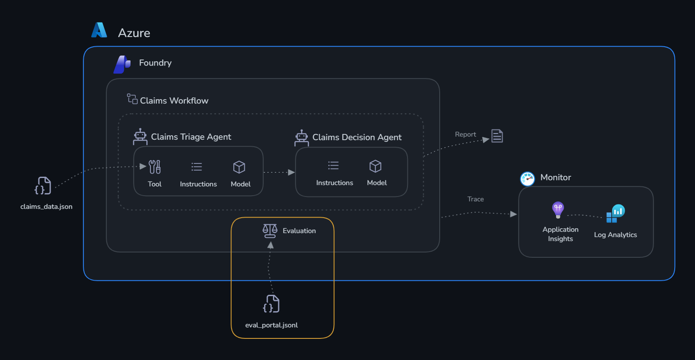

# Challenge 3: Evaluate

Time: ~30 minutes

## Objectives

By the end of this challenge, you will have:

- ✅ Run a systematic evaluation of your agents against a test dataset
- ✅ Used built-in evaluators (coherence, relevance) to measure quality
- ✅ Interpreted evaluation metrics and identified areas for improvement
- ✅ Understanding of how to integrate evaluations into a CI/CD pipeline

## Context

Monitoring tells you **what's happening** (latency, errors, token usage). Evaluation tells you **if the decisions are actually correct**.

You have a dataset of 10 test cases — each with claim metrics and the expected correct output (classification + recommended action). You'll run your agents against these test cases and measure how well they perform using LLM-as-judge scoring.

## Why Evaluate?

Monitoring tells you your agents are *running* — evaluation tells you they're doing the *right thing*. These are fundamentally different questions.

Monitoring captures **operational signals**: latency, token count, error rates, uptime. These tell you *how* the system behaves mechanically. Evaluation captures **quality signals**: are the agent's outputs correct, relevant, coherent, and consistent with expected outcomes? These tell you *whether* the system is actually doing its job.

Without systematic evaluation, you're relying on spot-checks — reading a handful of responses and judging them subjectively. This doesn't scale, isn't repeatable, and can't catch regressions when you update a prompt or switch models. Evaluation gives you a measurable baseline: a score you can track over time and compare across versions.

Evaluation also surfaces issues that monitoring is blind to. An agent that always responds quickly and without errors but consistently approves high-risk claims — or flags legitimate claims for unnecessary investigation — looks perfectly healthy to monitoring. Evaluation catches it immediately.

For production AI, evaluations should run:

- **Before deployment** — establish a quality baseline and gate releases on minimum scores
- **After any change** — to system prompts, models, tools, or policy documents in the knowledge base
- **On a schedule** — to detect drift as fraud patterns evolve or new claim types emerge

For ClaimSight specifically: an agent that approves CLM-001 (fraud risk score 0.87, document completeness 45%) because it generated a coherent-sounding rationale is a direct financial risk. Monitoring sees a successful response. Only evaluation — comparing the output against the expected "investigate" decision — catches the mistake.

## The Evaluation Dataset

The dataset lives at [challenge-4-deploy/evaluation_dataset.json](../challenge-4-deploy/evaluation_dataset.json) — it contains:

- 10 claims covering normal, warning, and critical scenarios
- Each has an `input` (what you send to the agent)
- Each has an `expected_output` (the correct classification and action)

## About the Evaluators

Microsoft Foundry uses an **LLM-as-judge** approach — a separate model reads each agent response alongside the input and ground truth, then scores it on a 1–5 scale. You’ll use two built-in evaluators:

- **Coherence** — measures whether the agent’s response is logically structured and internally consistent. A score of 5 means the output is clear, well-organised, and flows naturally. A low score means the response is contradictory, jumbled, or hard to follow. For a claims agent this catches things like recommending approval while simultaneously flagging a high fraud risk score.

- **Relevance** — measures whether the response actually addresses what was asked. A score of 5 means the agent correctly assessed the claim’s completeness, fraud indicators, and coverage match, then gave a pertinent action. A low score means the agent ignored key data points in the claim or gave a generic recommendation that doesn’t fit the scenario.

These two scores together give you a quick signal on output quality. When you see a low coherence score, look at the agent’s system prompt structure. When you see a low relevance score, look at how the agent weighs the fraud risk score and document completeness in its reasoning.

## Get Started

The evaluation dataset has already been prepared for you as [eval_portal.jsonl](./eval_portal.jsonl) — 10 insurance claim scenarios ready to upload.

---

### Step 1: Open the Evaluation tab

1. Go to the [Microsoft Foundry portal](https://ai.azure.com/nextgen) → your project
2. On the top bar → **Build** → **Evaluations** → **Create**

### Step 2: Configure the evaluation

3. Select **Agent** as the evaluation target
4. Choose `claims-triage-agent` from the dropdown
5. Select **Existing Dataset**
6. Upload `claims/challenge-3-evaluate/eval_portal.jsonl`
7. Map the `query` column to the agent input field → **Next** and leave **gpt-5.4** as the Judge model

### Step 3: Choose evaluators

8. Enable **Coherence** and **Relevance** → **Next**
9. Click **Submit**

### Step 4: View results

Results appear in the **Evaluate** tab within a few minutes. Click the run name to see per-row scores and the aggregate metric summary.

---

## Success Criteria

- [ ] Evaluation runs against all 10 test cases without errors
- [ ] You can see per-row scores for coherence and relevance
- [ ] You've identified at least one case where the agent could improve
- [ ] You understand the difference between aggregate metrics and per-row analysis
