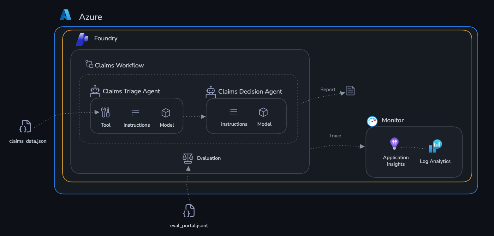

# Challenge 4: Production Workflow

Time: ~20 minutes

Build a multi-agent orchestration workflow for ClaimSight Insurance and take it to production.

## Scenario

The individual agents you built in Challenge 1 are valuable — but in production, agents need to work
**together** as an automated pipeline. In this challenge you wire the two agents into a full
claims processing workflow, run it from code, then build and test it visually in the Foundry portal.



## Learning Objectives

- Deploy persistent production agents (create once, reuse forever)
- Orchestrate multiple agents step-by-step in a Python workflow
- Build the same workflow visually in the Foundry portal
- Invoke the portal workflow from Python with live streaming
- View run history and traces in the portal

## The Workflow

```
ensure_agents_deployed()
        |
        v
run_claims_triage()             <-- Claims Triage Agent assesses all 5 claims
        |
        v (for each flagged claim)
run_claims_decision()           <-- Claims Decision Agent recommends action
        |
        v
print_claims_report()           <-- Consolidated Claims Processing Report
```

---

## Part 1 — SDK: Build and Run the Python Workflow

### Step 1: Review the implementation

Open [deploy.py](./deploy.py) and review:

- **`ensure_agents_deployed()`** — lists existing agents, creates `claims-triage-agent` and `claims-decision-agent` if not present
- **`run_claims_triage()`** — calls the triage agent, handles the `assess_claim` function call loop
- **`run_claims_decision()`** — calls the decision agent for each flagged claim
- **`run_claims_workflow()`** — orchestrates all steps and returns the consolidated report

### Step 2: Run the workflow

```bash
cd claims/challenge-4-deploy
python deploy.py
```

Expected output:
```
=== Step 1: Ensure Agents Are Deployed ===
  Found existing: claims-triage-agent
  Found existing: claims-decision-agent

=== Step 2a: Claims Triage ===
  CLM-001 CRITICAL: fraud_risk_score 64% above max, damage_vs_estimate_match 25.7% below min
  CLM-003 WARNING: completeness 25% below min
  CLM-005 WARNING: fraud_risk_score 16% above max, damage_vs_estimate_match 8.6% below min
  ...

=== Step 2b: Claims Decisions ===
  Deciding on CLM-001...
  Deciding on CLM-003...
  Deciding on CLM-005...

CLAIMSIGHT INSURANCE — CLAIMS PROCESSING REPORT
  Claims assessed    : 5
  Claims flagged     : 3
  ...
```

---

## Part 2 — Portal: Build and Test the Visual Workflow

### Step 3: Verify agents are deployed in the portal

1. Open the [Microsoft Foundry portal](https://ai.azure.com/nextgen)
2. Select your project
3. Left sidebar → **Build** → **Agents**
4. Confirm both agents appear:
   - `claims-triage-agent`
   - `claims-decision-agent`

### Step 4: Test the Claims Triage Agent

1. Click **claims-triage-agent** → **Playground**
2. Send:
   ```
   Assess CLM-001 and CLM-003. What flags do you find?
   ```
3. The agent will call `assess_claim` for each claim and return a triage report

### Step 5: Test the Claims Decision Agent

1. Click **claims-decision-agent** → **Playground**
2. Send:
   ```
   CLM-001 is flagged: fraud_risk_score 82 (above max 50), damage_vs_estimate_match 52% (below min 70%). Recommend an action.
   ```
3. The agent should recommend denial or escalation with justification

### Step 6: Build the workflow in the portal designer

1. Left sidebar → **Build** → **Workflows** → **New workflow**
2. Add two steps:
   - Step 1: `claims-triage-agent` — "Assess all claims and report flags"
   - Step 2: `claims-decision-agent` — "For each flagged claim, recommend an action"
3. Deploy the workflow and note the agent name

### Step 7: Test the workflow in the portal playground

> **Why you must include the claims data in your message**
>
> The agents use an `assess_claim` tool that reads from a local Python file.
> The portal playground **cannot execute Python functions** — if you send a generic
> prompt, the agent will try to call the tool and stall waiting for a result that
> never arrives. Paste the claims data directly into your message so the agents can
> work without needing the tool.

1. Open **claims-processing-workflow** → **Playground**
2. Paste the following message (data is pre-embedded so no tool calls are needed):

   ```
   All claims data for today is below — analyse it directly, do not call assess_claim.

   CLM-001 | Maria Torres | auto_collision | filed 2026-05-01 | status: critical
     completeness: 100%  [min 80%] ✅
     damage_vs_estimate_match: 52%  [min 70%] 🔴 BELOW MIN
     fraud_risk_score: 82  [max 50] 🔴 ABOVE MAX
     policy_coverage_match: 95%  [min 85%] ✅
     documents: police_report, photos, repair_estimate, medical_report

   CLM-002 | James Chen | property_water_damage | filed 2026-04-28 | status: normal
     completeness: 100%  [min 80%] ✅
     damage_vs_estimate_match: 88%  [min 70%] ✅
     fraud_risk_score: 15  [max 50] ✅
     policy_coverage_match: 98%  [min 85%] ✅
     documents: photos, plumber_report, repair_estimate, inventory_list

   CLM-003 | Robert Kim | auto_theft | filed 2026-05-03 | status: warning
     completeness: 60%  [min 80%] ⚠️ BELOW MIN
     damage_vs_estimate_match: 0%  [min 70%] ⚠️ BELOW MIN
     fraud_risk_score: 45  [max 50] ✅
     policy_coverage_match: 90%  [min 85%] ✅
     documents: police_report, vehicle_registration

   CLM-004 | Sarah Williams | property_fire | filed 2026-04-25 | status: normal
     completeness: 100%  [min 80%] ✅
     damage_vs_estimate_match: 91%  [min 70%] ✅
     fraud_risk_score: 12  [max 50] ✅
     policy_coverage_match: 100%  [min 85%] ✅
     documents: fire_department_report, photos, repair_estimate, inventory_list

   CLM-005 | David Okafor | auto_collision | filed 2026-05-05 | status: warning
     completeness: 85%  [min 80%] ✅
     damage_vs_estimate_match: 64%  [min 70%] ⚠️ BELOW MIN
     fraud_risk_score: 58  [max 50] ⚠️ ABOVE MAX
     policy_coverage_match: 92%  [min 85%] ✅
     documents: police_report, photos, repair_estimate

   Triage each claim for completeness and fraud indicators, then make an approval or denial decision for each with clear justification.
   ```

3. Watch the steps execute in sequence — triage first, then decisions
4. Review the approval/denial decisions with justifications

### Step 8: Invoke the portal workflow from Python (streaming)

Set `WORKFLOW_AGENT_NAME=claims-processing-workflow` in `.env`, then re-run:

```bash
python deploy.py
```

The script will stream `workflow_action` events as the workflow executes each step:

```
[workflow] Starting step: claims-triage-agent
[workflow] Completed step: claims-triage-agent
[workflow] Starting step: claims-decision-agent
[workflow] Completed step: claims-decision-agent
<final report streamed here>
```

### Step 9: View run history and traces

1. Portal → your workflow → **Run history** tab
2. Click the latest run to see the execution timeline — each step, duration, and output
3. Left sidebar → **Operate** → **Tracing** to see the full distributed trace across both agent conversations

---

## Success Criteria

- [ ] Python workflow runs end-to-end: triage → decisions → claims report
- [ ] Both agents visible in the Foundry portal as persistent assets
- [ ] Visual workflow created in the portal and tested in its playground
- [ ] Portal workflow invoked from Python with live step streaming

---

## Beyond the Lab: Production Deployment Options

You've built and tested your agents locally. Here's how to take them to production:

### Option 1: Hosted Agents (What You Already Have)

Your agents created with `agents.create_version()` are already production-ready hosted agents. They live in Foundry indefinitely — any client can invoke them by name via the Responses API. No infrastructure to manage; Foundry handles scaling, versioning, and availability.

- **Versioning**: Each `create_version()` produces an immutable version. Roll back by referencing an older version.
- **Multi-tenant**: Multiple users/apps can call the same agent simultaneously.
- **Portal visibility**: Agents appear under Build → Agents with playground, run history, and tracing.

### Option 2: Foundry Workflows (Visual Orchestration)

What you built in Part 2 — wire multiple hosted agents into a DAG using the portal designer. The workflow becomes a deployable agent invoked via the same Responses API.

- Step sequencing with automatic output passing
- Streaming `workflow_action` events showing progress
- Run history with per-step timing

### Option 3: Azure App Service / Container Apps

Wrap your Python workflow in a FastAPI/Flask app for custom middleware, auth, or business logic:

```python
# Example: FastAPI endpoint that calls your Foundry agents
@app.post("/process-claims")
async def process_claims():
    report = run_claims_workflow(triage_agent, decision_agent)
    return report
```

Deploy to **App Service** (managed PaaS) or **Container Apps** (auto-scaling containers).

### Option 4: Azure Functions (Event-Driven)

Trigger agent workflows from events:

- **Blob trigger**: Process each new claim document as it's uploaded
- **Service Bus trigger**: Handle claims from a message queue
- **HTTP trigger**: On-demand endpoint for claims adjusters

Pay-per-execution, scales to zero when idle.

### Option 5: CI/CD Quality Gates

Integrate evaluation into your deployment pipeline:

- Run `evaluate.py` on every PR — block merge if quality drops below threshold
- Promote agent versions: `v1-dev` → `v1-staging` → `v1-prod` after evaluation passes
- Blue/green: Deploy new version to 10% traffic, compare metrics, then promote

### Summary

| Pattern | Best For |
|---------|----------|
| Hosted Agents | Always-on, invoke by name, no infra management |
| Foundry Workflows | Multi-agent orchestration without code |
| App Service / Containers | Custom auth, middleware, webhooks |
| Azure Functions | Event-driven, pay-per-use, document processing |
| CI/CD Gates | Automated quality assurance before promotion |

